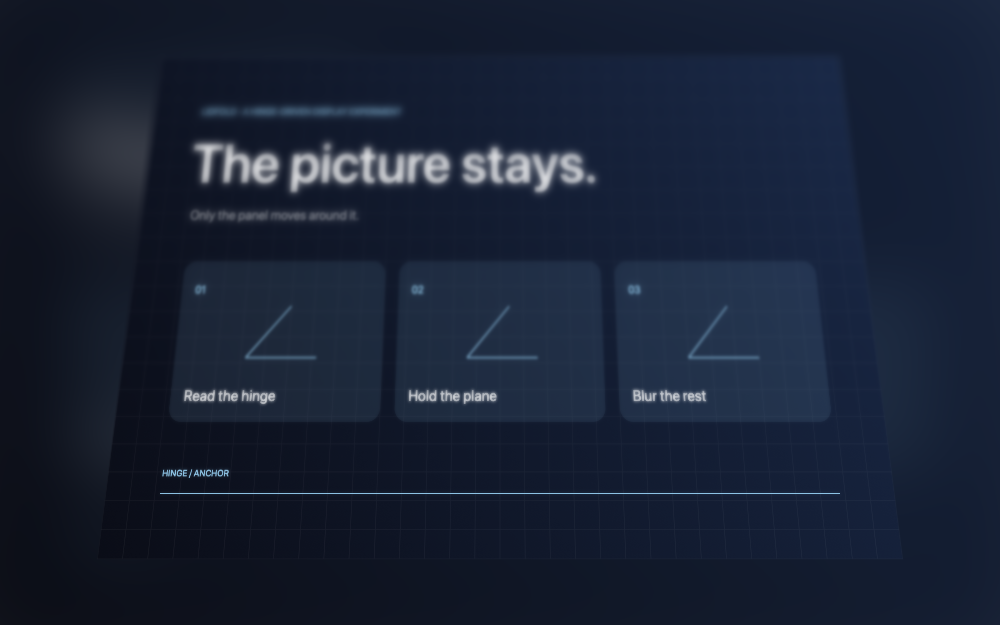

# LidFold

A menu bar app that holds your desktop at a fixed apparent angle while the MacBook lid
moves around it, blurring the image progressively as the hinge opens or closes. Stop
moving and it settles back into place. Your apps stay clickable and keep keyboard focus
the whole time.



## Requirements

- macOS 13 or newer
- An Apple silicon MacBook with a readable lid angle sensor
- Screen Recording permission, which macOS asks for the first time you enable the effect

The sensor interface is undocumented and support varies between models. Run
`./Scripts/probe.sh` to find out whether your Mac exposes one before going any further,
and `./Scripts/capture-check.sh` to confirm the Screen Recording grant.

## Build and run

```bash
git clone https://github.com/TahsinEfe/LidFold.git
cd LidFold
./Scripts/run.sh
```

There are no third-party dependencies. The script builds the package, assembles
`dist/LidFold.app` and launches it. Look for the laptop icon in the menu bar: there is no
Dock icon and no window. Click the icon to switch the effect on, then approve Screen
Recording when macOS asks.

## Controls

| Action | How |
| --- | --- |
| Turn the effect on or off | Click the menu bar icon, or press ⌃⌘L |
| Open the options | Right-click or Control-click the icon |
| Reset the starting angle | **Anchor Here** |
| Settle back after you stop moving | **Auto-anchor When Still**, on by default |
| Change the settling delay | **Pause Before Anchoring** → 0.15, 0.3, 0.5, 1 or 2 seconds |
| Blur without the geometric distortion | Keep **Progressive Blur** on, turn **Hold Content Angle** off |
| More dramatic distortion | Turn **Perspective Taper** on |
| Change how hard the effect pushes | **Effect Strength** → Subtle, Standard, Strong or Extreme |
| See the raw sensor reading | **Show Lid Angle in Menu Bar** |
| Try it without touching the lid | Enable the effect, then **Simulate a Fold** |
| Quit | **Quit LidFold** |

**Effect Strength** amplifies the effect only while the lid is closing, which is the
gesture people actually make; opening past the anchor stays at 1:1, where anything
stronger reads as the image sliding off the panel. The default is **Strong**.

Auto-anchor waits 150 ms by default and then eases back over 200 ms. Turn it off if you
want the image to hold its original angle indefinitely, which is what you want while
filming the effect. Options are remembered between launches.

## How it works

1. **ScreenCaptureKit provides the picture.** LidFold streams the built-in display and
   excludes its own overlay from that stream, so the effect never captures itself. Frames
   stay in memory; nothing is written to disk and nothing leaves the Mac.
2. **IOKit reads the hinge.** The lid angle sensor is polled about 30 times a second over
   HID, read-only, and compared against a saved reference angle.
3. **A Metal shader reshapes the frame.** The angle difference moves the image's pixels so
   the content appears to hold its angle while the panel tilts around it. It is an
   approximation of a fixed viewpoint, not head tracking.
4. **The plane pulls away from the panel.** As the lid closes the desktop shrinks towards
   the centre and stays readable there. The space it leaves is filled with a heavily
   blurred copy of the same desktop, pushed back so it reads as depth rather than as a
   second, wrongly placed screen. Four increasingly blurred copies of the frame are kept
   for this, and blended per pixel.
5. **It settles when you stop.** The reference angle eases onto the current one, the
   overlay hides, and the real desktop is back. The overlay never takes focus and lets
   every click through.

## Troubleshooting

- **Enabled, but nothing happens.** Check that **Progressive Blur** is on, then try
  **Simulate a Fold**. If the simulation works but the lid does not, switch on the angle
  readout: a missing or frozen number means the sensor is not readable on your model.
- **The effect disappears when I pause.** That is auto-anchor. Switch it off to hold.
- **Screen Recording is granted but capture still fails.** Quit LidFold, remove its entry
  under System Settings → Privacy & Security → Screen & System Audio Recording, then
  reopen and approve it again. Rebuilding the app changes its code identity, which macOS
  treats as a different app.
- **A click lands somewhere unexpected while moving.** Only the image is transformed, not
  the click targets underneath it. Let the lid settle before clicking precisely.

Only the built-in display is transformed. Protected video may appear blank, and the
capture is SDR.

## Privacy

Screen Recording permission lets LidFold process your display. There is no networking,
no audio or camera use, no Accessibility or Input Monitoring permission, no login item
and no recording of any kind. To remove it, quit the app and delete the bundle.

## Project layout

See [Docs/ARCHITECTURE.md](Docs/ARCHITECTURE.md) for how the modules fit together and
[Docs/DEVELOPMENT.md](Docs/DEVELOPMENT.md) for the build, test and packaging commands.

## Licence

MIT. See [LICENSE](LICENSE).

An independent experiment, not affiliated with or endorsed by Apple.
